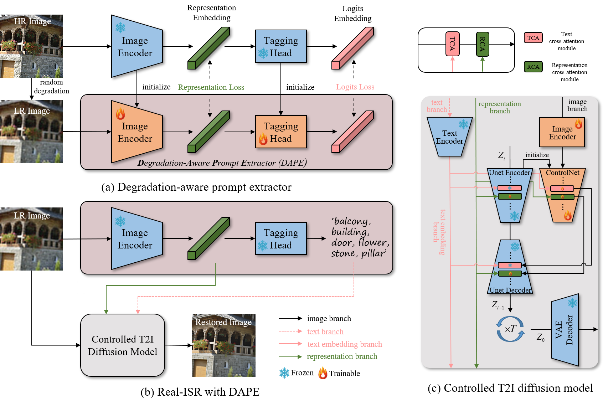
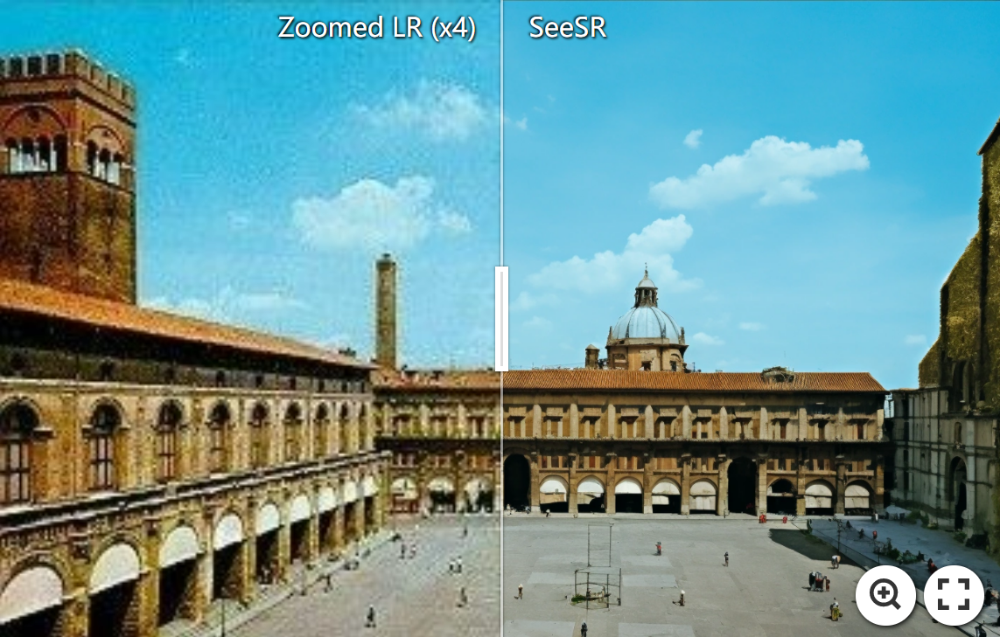
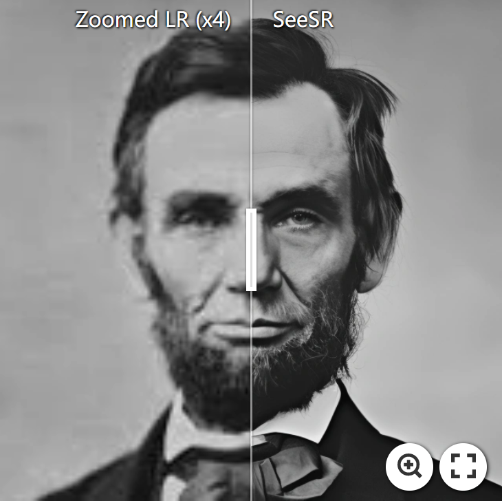
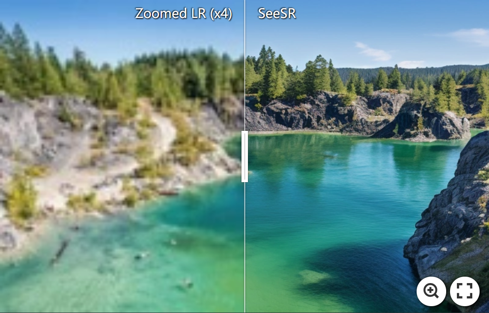
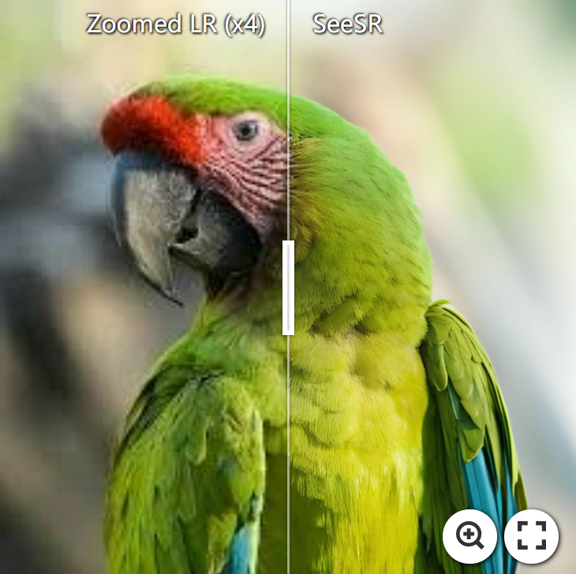
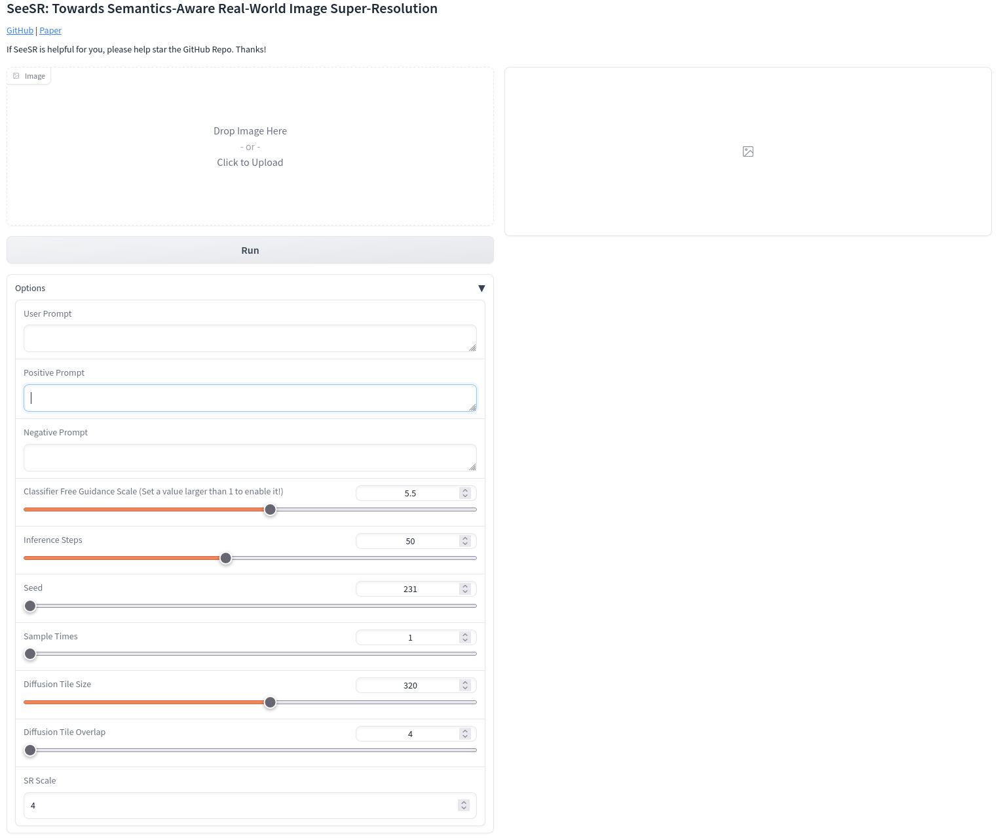

<div align=center class="logo">
      
   </a>
</div>

      
## SeeSR: Towards Semantics-Aware Real-World Image Super-Resolution (CVPR2024)

<a href='https://arxiv.org/abs/2311.16518'></a> &nbsp;&nbsp;
<a href='https://replicate.com/lucataco/seesr'></a> &nbsp;&nbsp;

[Rongyuan Wu](https://scholar.google.com.hk/citations?hl=zh-CN&user=A-U8zE8AAAAJ)<sup>1,2</sup> | [Tao Yang](https://cg.cs.tsinghua.edu.cn/people/~tyang/)<sup>3</sup> | [Lingchen Sun](https://scholar.google.com/citations?hl=zh-CN&tzom=-480&user=ZCDjTn8AAAAJ)<sup>1,2</sup> | [Zhengqiang Zhang](https://scholar.google.com.hk/citations?hl=zh-CN&user=UX26wSMAAAAJ)<sup>1,2</sup> | [Shuai Li](https://scholar.google.com.hk/citations?hl=zh-CN&user=Bd73ldQAAAAJ)<sup>1,2</sup> | [Lei Zhang](https://www4.comp.polyu.edu.hk/~cslzhang/)<sup>1,2</sup>

<sup>1</sup>The Hong Kong Polytechnic University, <sup>2</sup>OPPO Research Institute, <sup>3</sup>ByteDance Inc.

:star: If SeeSR is helpful to your images or projects, please help star this repo. Thanks! :hugs:

#### 🚩Accepted by CVPR2024


### 📢 News
- **2024.01.12** 🔥🔥🔥 Integrated to <a href='https://replicate.com/lucataco/seesr'></a> Try out <u>[Replicate](https://replicate.com/lucataco/seesr)</u> online demo ❤️ Thanks [lucataco](https://github.com/lucataco) for the implementation. 
- **2024.01.09** 🚀 Add Gradio demo.
- **2023.12.25** 🎅🎄🎅🎄 *Merry Christmas!!!* 
  - 🍺 Release SeeSR-SD2-Base, including the codes and pretrained models. 
  - 📏 We also release `RealLR200`. It includes 200 real-world low-resolution images.
- **2023.11.28** Create this repo.

### 📌 TODO
- [ ] SeeSR-SDXL
- [ ] SeeSR-SD2-Base-face,text
- [ ] SeeSR Acceleration

## 🔎 Overview framework


## 📷 Real-World Results
[](https://imgsli.com/MjI5MTA2) [](https://imgsli.com/MjI5MTA3)
[](https://imgsli.com/MjI5MTA0) [](https://imgsli.com/MjI5MTA1) 


## ⚙️ Dependencies and Installation
```
## git clone this repository
git clone https://github.com/cswry/SeeSR.git
cd SeeSR

# create an environment with python >= 3.8
conda create -n seesr python=3.8
conda activate seesr
pip install -r requirements.txt
```

## 🚀 Quick Inference
#### Step 1: Download the pretrained models
- Download the pretrained SD-2-base models from [HuggingFace](https://huggingface.co/stabilityai/stable-diffusion-2-base).
- Download the SeeSR and DAPE models from [GoogleDrive](https://drive.google.com/drive/folders/12HXrRGEXUAnmHRaf0bIn-S8XSK4Ku0JO?usp=drive_link) or [OneDrive](https://connectpolyu-my.sharepoint.com/:f:/g/personal/22042244r_connect_polyu_hk/EiUmSfWRmQFNiTGJWs7rOx0BpZn2xhoKN6tXFmTSGJ4Jfw?e=RdLbvg).

You can put the models into `preset/models`.

#### Step 2: Prepare testing data
You can put the testing images in the `preset/datasets/test_datasets`.

#### Step 3: Running testing command
```
python test_seesr.py \
--pretrained_model_path preset/models/stable-diffusion-2-base \
--prompt None \
--seesr_model_path preset/models/seesr \
--ram_ft_path preset/models/DAPE.pth \
--image_path preset/datasets/test_datasets \
--output_dir preset/datasets/output \
--start_point lr \
--num_inference_steps 50 \
--guidance_scale 5.5 \
--process_size 512 
```

The default settings are optimized for the best result. However, the behavior of the code can be customized
- Trade-offs between the **fidelity** and **perception**  
  - `--num_inference_steps` Using more sampling steps in `Real-world SR` tasks is not a purely beneficial choice. While it improves the perception quality, it can also reduce fidelity quality as it generates more. Considering the trade-offs between fidelity and perception, as well as the inference time cost, we set the default value to `50`. However, you can make appropriate adjustments based on your specific needs.
  - `--guidance_scale` A higher value means unleashing more generation capacity of SD, which improves perception quality but decreases fidelity quality. We set the default value to `5.5`, you can make appropriate adjustments based on your specific needs.
  - `--process_size` The inference script resizes input images to the `process_size`, and then resizes the prediction back to the original resolution after process. We found that increasing the processing size (e.g. 768) improves fidelity but decreases perception. We set the default value to `512`, consistent with the training size of the pre-trained SD model. You can make appropriate adjustments based on your specific needs.

- User-specified mode
  - `--prompt` SeeSR utilizes DAPE to automatically extract tag prompts from LR images, but it is not the most perfect approach. You can try manually specifying appropriate tag prompts to further enhance the quality of the results.

#### Note
Please read the arguments in `test_seesr.py` carefully. We adopt the tiled vae method proposed by [multidiffusion-upscaler-for-automatic1111](https://github.com/pkuliyi2015/multidiffusion-upscaler-for-automatic1111) to save GPU memory.

#### Gradio Demo
Please put the all pretrained models at `preset/models`, and then run the following command to interact with the gradio website.
```
python gradio_seesr.py 
```



#### Test Benchmark
We release our `RealLR200` at [GoogleDrive](https://drive.google.com/drive/folders/1L2VsQYQRKhWJxe6yWZU9FgBWSgBCk6mz?usp=drive_link) and [OneDrive](https://connectpolyu-my.sharepoint.com/:f:/g/personal/22042244r_connect_polyu_hk/EmRLN-trNypJtO4tqleF4mAB5pVME060hRj6xuBXGsUCaA?e=PykXVx). You can download `RealSR` and `DRealSR` from [StableSR](https://huggingface.co/datasets/Iceclear/StableSR-TestSets). We also provide the copy of that at [GoogleDrive](https://drive.google.com/drive/folders/1L2VsQYQRKhWJxe6yWZU9FgBWSgBCk6mz?usp=drive_link) and [OneDrive](https://connectpolyu-my.sharepoint.com/:f:/g/personal/22042244r_connect_polyu_hk/EmRLN-trNypJtO4tqleF4mAB5pVME060hRj6xuBXGsUCaA?e=PykXVx). As for the synthetic test set, you can obtain it through the synthetic methods described below.

## 🌈 Train 

#### Step1: Download the pretrained models
Download the pretrained [SD-2-base models](https://huggingface.co/stabilityai/stable-diffusion-2-base) and [RAM](https://huggingface.co/spaces/xinyu1205/recognize-anything/blob/main/ram_swin_large_14m.pth). You can put them into `preset/models`.

#### Step2: Prepare training data
We pre-prepare training data pairs for the training process, which would take up some memory space but save training time. We train the DAPE with [COCO](https://cocodataset.org/#home) and train the SeeSR with common low-level datasets, such as DF2K.

For making paired data when training DAPE, you can run:

```
python utils_data/make_paired_data_DAPE.py \
--gt_path PATH_1 PATH_2 ... \
--save_dir preset/datasets/train_datasets/training_for_dape \
--epoch 1
```
For making paired data when training SeeSR, you can run:
```
python utils_data/make_paired_data.py \
--gt_path PATH_1 PATH_2 ... \
--save_dir preset/datasets/train_datasets/training_for_dape \
--epoch 1
```

- `--gt_path` the path of gt images. If you have multi gt dirs, you can set it as `PATH1 PATH2 PATH3 ...`
- `--save_dir` the path of paired images 
- `--epoch` the number of epoch you want to make

The difference between `make_paired_data_DAPE.py` and `make_paired_data.py` lies in that `make_paired_data_DAPE.py` resizes the entire image to a resolution of 512, while `make_paired_data.py` randomly crops a sub-image with a resolution of 512.


Once the degraded data pairs are created, you can base them to generate tag data by running `utils_data/make_tags.py`.

The data folder should be like this:
```
your_training_datasets/
    └── gt
        └── 0000001.png # GT images, (512, 512, 3)
        └── ...
    └── lr
        └── 0000001.png # LR images, (512, 512, 3)
        └── ...
    └── tag
        └── 0000001.txt # tag prompts
        └── ...
```

#### Step3: Training for DAPE
Please specify the DAPE training data path at `line 13` of `basicsr/options/dape.yaml`, then run the training command:
```
python basicsr/train.py -opt basicsr/options/dape.yaml
```
You can modify the parameters in `dape.yaml` to adapt to your specific situation, such as the number of GPUs, batch size, optimizer selection, etc. For more details, please refer to the settings in Basicsr. 
#### Step4: Training for SeeSR
```
CUDA_VISIBLE_DEVICES="0,1,2,3,4,5,6,7," accelerate launch train_seesr.py \
--pretrained_model_name_or_path="preset/models/stable-diffusion-2-base" \
--output_dir="./experience/seesr" \
--root_folders 'preset/datasets/training_datasets' \
--ram_ft_path 'preset/models/DAPE.pth' \
--enable_xformers_memory_efficient_attention \
--mixed_precision="fp16" \
--resolution=512 \
--learning_rate=5e-5 \
--train_batch_size=2 \
--gradient_accumulation_steps=2 \
--null_text_ratio=0.5 
--dataloader_num_workers=0 \
--checkpointing_steps=10000 
```
- `--pretrained_model_name_or_path` the path of pretrained SD model from Step 1
- `--root_folders` the path of your training datasets from Step 2
- `--ram_ft_path` the path of your DAPE model from Step 3


The overall batch size is determined by num of `CUDA_VISIBLE_DEVICES`, `--train_batch_size`, and `--gradient_accumulation_steps` collectively. If your GPU memory is limited, you can consider reducing `--train_batch_size` while increasing `--gradient_accumulation_steps`.


## ❤️ Acknowledgments
This project is based on [diffusers](https://github.com/huggingface/diffusers) and [BasicSR](https://github.com/XPixelGroup/BasicSR). Some codes are brought from [PASD](https://github.com/yangxy/PASD) and [RAM](https://github.com/xinyu1205/recognize-anything). Thanks for their awesome works. We also pay tribute to the pioneering work of [StableSR](https://github.com/IceClear/StableSR).

## 📧 Contact
If you have any questions, please feel free to contact: `rong-yuan.wu@connect.polyu.hk`

## 🎓Citations
If our code helps your research or work, please consider citing our paper.
The following are BibTeX references:

```
@article{wu2023seesr,
  title={SeeSR: Towards Semantics-Aware Real-World Image Super-Resolution},
  author={Wu, Rongyuan and Yang, Tao and Sun, Lingchen and Zhang, Zhengqiang and Li, Shuai and Zhang, Lei},
  journal={arXiv preprint arXiv:2311.16518},
  year={2023}
}
```

## 🎫 License
This project is released under the [Apache 2.0 license](LICENSE).


<details>
<summary>statistics</summary>


</details>
